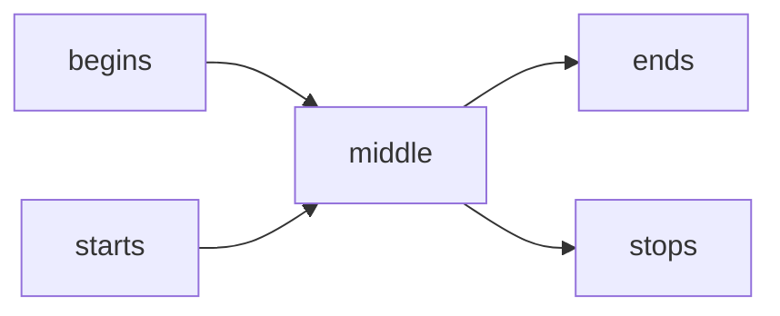
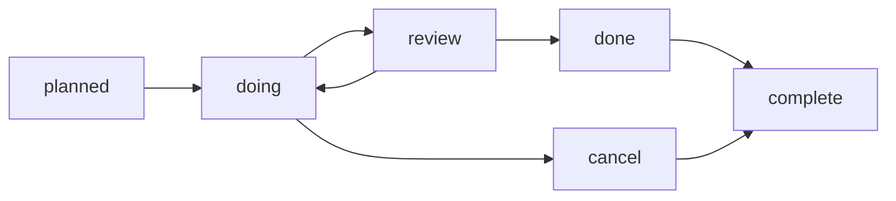

# Graph Module

Lightweight Graph implementation, providing edges and (shortest) path determination

## Installation

```
$ npm install --save @konfirm/graph
```

## Usage

```ts
import { Graph } from '@konfirm/graph';

const graph = new Graph<string>();

// the regular flow of A -> B -> C -> D -> E
graph.edge('A', 'B');
graph.edge('B', 'C');
graph.edge('C', 'D');
graph.edge('D', 'E');

// show various shortest paths
console.log('A -> C', graph.shortest('A', 'C')); // ['A', 'B', 'C']
console.log('A -> E', graph.shortest('A', 'E')); // ['A', 'B', 'C', 'D', 'E'];
console.log('B -> E', graph.shortest('B', 'E')); // ['B', 'C', 'D', 'E'];
```

A very basic linear flow, could have been solved with just an array... so let's add a little more fun to the flow

```ts
// allow to move back from B -> A
graph.edge('B', 'A');

// allow to move from A -> E
graph.edge('A', 'E');

// show various shortest paths
console.log('A -> C', graph.shortest('A', 'C')); // ['A', 'B', 'C']
console.log('A -> E', graph.shortest('A', 'E')); // ['A', 'E'];
console.log('B -> E', graph.shortest('B', 'E')); // ['B', 'A', 'E'];
```

With the shortcut from A -> E in place, added with the allowed moving back from B -> A, suddenly the shortest path changes. This is what makes Graph a simple but powerful tool to use.


## API

The only export from the '@konfirm/graph' package is the `Graph` class itself.

### Graph

The Graph allows TypeScript users to specify the type of the vertices it handles, it defaults to `unknown` so you're probably better off providing a reasonable value.

```ts
import { Graph } from '@konfirm/graph';

const graph = new Graph<number>();
```

#### `<Graph>.edge(source: T, destination1: T [, ...destination:T]): number`

Register one or more edges between vertices. This is like stating 'from source, one can reach this destination/these destionations directly'.
A word of caution, if objects are used as vertex always use the exact same instance, as these vertices are compared as is (strict equality).
The number returned is the number of adges actually added, any existing edge is preserved.

#### `<Graph>.drop(source: T [, ...destination: T]): number`

Remove all or only the known provided edges. This is like stating 'from source, one can no longer read any/these destinations directly'.

#### `Set<T> <Graph>.sources`

Obtain all source vertices as a Set, a source is any vertex which has one or more destinations.

```ts
import { Graph } from '@konfirm/graph';

const graph = new Graph<string>();

graph.edge('begins', 'middle');
graph.edge('middle', 'ends');
graph.edge('starts', 'middle');
graph.edge('middle', 'stops');

console.log(graph.sources)); // Set{'begins','middle','starts'}
```




#### `Set<T> <Graph>.destinations`

Obtain all destinations as a Set, a destination is any vertex which is led to from one or more sources.

```ts
import { Graph } from '@konfirm/graph';

const graph = new Graph<string>();

graph.edge('begins', 'middle');
graph.edge('middle', 'ends');
graph.edge('starts', 'middle');
graph.edge('middle', 'stops');

console.log(graph.destinations)); // Set{'middle', 'ends', 'stops'}
```


#### `Set<T> <Graph>.starters`

Obtain all starters as a Set, a starter is any source vertex which in itself is not a destination.

```ts
import { Graph } from '@konfirm/graph';

const graph = new Graph<string>();

graph.edge('begins', 'middle');
graph.edge('middle', 'ends');
graph.edge('starts', 'middle');
graph.edge('middle', 'stops');

console.log(graph.starters)); // Set{'begins', 'starts'}
```


#### `Set<T> <Graph>.stoppers`

Obtain all stoppers as a Set, a stopper is any destination vertex which in itself is not a source.


```ts
import { Graph } from '@konfirm/graph';

const graph = new Graph<string>();

graph.edge('begins', 'middle');
graph.edge('middle', 'ends');
graph.edge('starts', 'middle');
graph.edge('middle', 'stops');

console.log(graph.stoppers)); // Set{'ends', 'stops'}
```


#### `async <Graph>.paths(start?: T, stop?: T): Promise<Array<Array<T>>>`

Obtain all possible paths, optionally from start and/or to stop.

```ts
import { Graph } from '@konfirm/graph';

const graph = new Graph<string>();

graph.edge('begins', 'middle');
graph.edge('middle', 'ends');
graph.edge('starts', 'middle');
graph.edge('middle', 'stops');

graph.paths()
  .then((paths) => console.log(paths)); // [['begins','middle','ends'],['begins','middle','stops'],['starts','middle','ends'],['starts','middle','stops']]
```


#### `async <Graph>.shortest(start?: T, stop?: T): Promise<Array<T> | undefined>`

Obtain the shortest possible path, optionally from start and/or to stop.

```ts
import { Graph } from '@konfirm/graph';

const graph = new Graph<string>();

graph.edge('planned', 'doing');
graph.edge('doing', 'review');
graph.edge('doing', 'cancel');
graph.edge('review', 'done');
graph.edge('review', 'doing');
graph.edge('done', 'complete');
graph.edge('cancel', 'complete');

graph.shortest()
  .then((path) => console.log(path)); // ['planned', 'doing', 'cancel', 'complete']

graph.shortest('doing')
  .then((path) => console.log(path)); // ['doing', 'cancel', 'complete']

graph.shortest('review', 'cancel')
  .then((path) => console.log(path)); // ['review', 'doing', 'cancel']

```



## Licence

MIT License

Copyright (c) 2023 Rogier Spieker (Konfirm)

Permission is hereby granted, free of charge, to any person obtaining a copy
of this software and associated documentation files (the 'Software'), to deal
in the Software without restriction, including without limitation the rights
to use, copy, modify, merge, publish, distribute, sublicense, and/or sell
copies of the Software, and to permit persons to whom the Software is
furnished to do so, subject to the following conditions:

The above copyright notice and this permission notice shall be included in all
copies or substantial portions of the Software.

THE SOFTWARE IS PROVIDED 'AS IS', WITHOUT WARRANTY OF ANY KIND, EXPRESS OR
IMPLIED, INCLUDING BUT NOT LIMITED TO THE WARRANTIES OF MERCHANTABILITY,
FITNESS FOR A PARTICULAR PURPOSE AND NONINFRINGEMENT. IN NO EVENT SHALL THE
AUTHORS OR COPYRIGHT HOLDERS BE LIABLE FOR ANY CLAIM, DAMAGES OR OTHER
LIABILITY, WHETHER IN AN ACTION OF CONTRACT, TORT OR OTHERWISE, ARISING FROM,
OUT OF OR IN CONNECTION WITH THE SOFTWARE OR THE USE OR OTHER DEALINGS IN THE
SOFTWARE.
